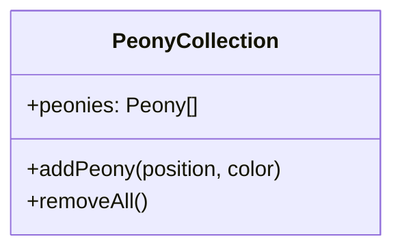
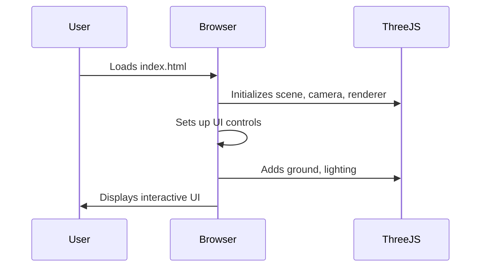
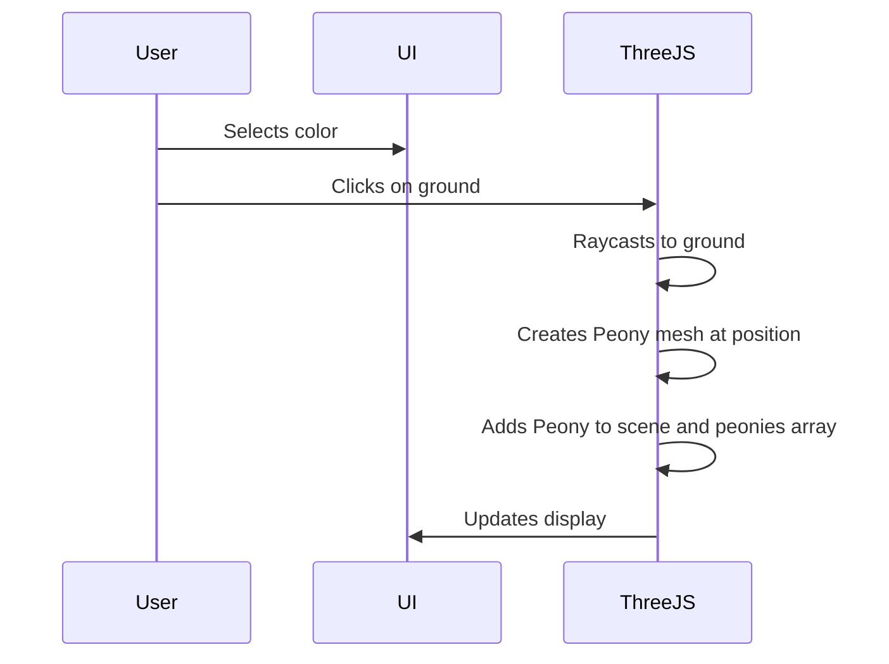
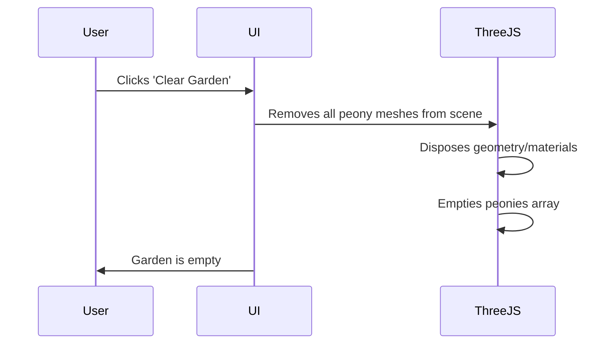

# 3D Peony Garden Architectural Documentation

## High-Level Application Overview and Purpose

The **3D Peony Garden** is a browser-based interactive web application that allows users to create and arrange a virtual garden of peony flowers in a 3D environment. Users can select flower colors, plant peonies by clicking on the ground, and clear the garden. The application is designed for creativity, relaxation, and visual enjoyment, leveraging modern web technologies for real-time 3D rendering.

## Main Components

### 1. Frontend
- **Technology:** HTML, CSS, JavaScript (ES Modules), [Three.js](https://threejs.org/)
- **Responsibilities:**
  - Render the 3D scene (garden, flowers, ground, lighting)
  - Handle user interactions (color selection, planting, clearing)
  - Manage UI controls and feedback

### 2. Backend
- **None** (The application is fully client-side and static. No backend server logic is present.)

### 3. Database
- **None** (All state is managed in-memory in the browser. No persistent storage.)

### 4. External Integrations
- **Three.js CDN** for 3D rendering
- **Google Fonts CDN** for UI typography

## Key Data Models

The application is simple and does not use formal data models or persistent storage. However, the following in-memory structures are central:

### Peony
```mermaid
classDiagram
    class Peony {
        +THREE.Group mesh
        +color: number
        +position: {x, y, z}
    }
```
- **mesh**: The 3D group object representing the peony (petals, stem, leaves)
- **color**: The color of the peony (hex number)
- **position**: The 3D coordinates where the peony is planted

### Peony Collection

- **peonies**: Array of all peony objects currently in the scene

## Core Workflows

### 1. Application Initialization


### 2. Planting a Peony


### 3. Clearing the Garden


## Tech Stack

| Layer      | Technology                |
|------------|---------------------------|
| Frontend   | HTML, CSS, JavaScript     |
| 3D Engine  | Three.js (via CDN)        |
| UI Fonts   | Google Fonts (Inter)      |
| Backend    | None                      |
| Database   | None                      |

## Component Diagram

```mermaid
flowchart TD
    subgraph Browser
        UI[UI Controls]
        Scene[3D Scene (Three.js)]
        PeonyArray[Peony Collection]
    end
    UI -- user events --> Scene
    UI -- user events --> PeonyArray
    Scene -- render --> UI
    PeonyArray -- add/remove --> Scene
```

## Data Model Diagram

```mermaid
classDiagram
    class Peony {
        +color: number
        +position: {x, y, z}
        +mesh: THREE.Group
    }
    class PeonyCollection {
        +peonies: Peony[]
    }
    PeonyCollection --> Peony
```

---

**Note:**
- This application is a static, client-only web app. There is no backend or database.
- All diagrams are generated using Mermaid syntax for easy integration with documentation tools.
